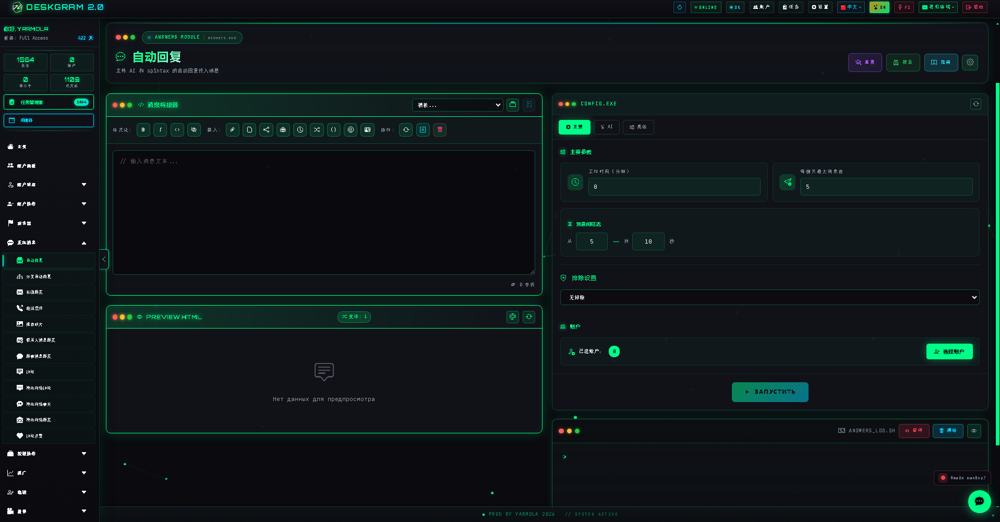
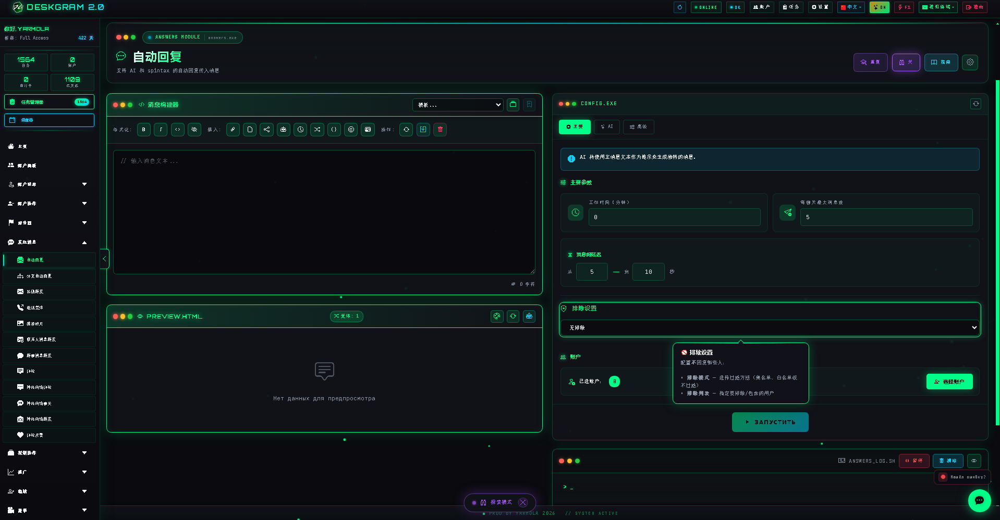
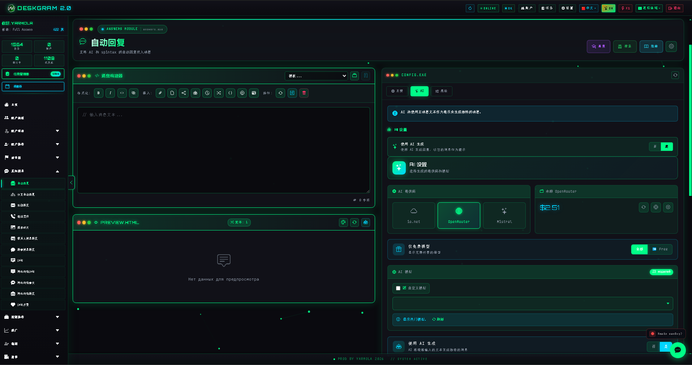
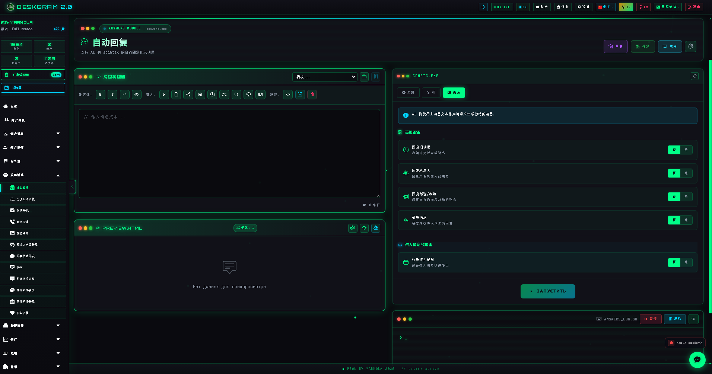

# Deskgram 2 自动回复

自动回复是 Deskgram 2 中用于 Telegram 来信自动处理的模块。它可以把模板回复、AI 回复、排除规则和后台回复逻辑组合在一起，帮助你在不持续手动值守的情况下承接更多对话。

[Deskgram 2 中文总览](https://github.com/Deskgram-2/deskgram-2-telegram-automation-zh) | [官网](https://deskgram2.com/) | [Telegram Bot](https://t.me/DG2welcomebot) | [Web Preview](https://deskgram2.com/web-preview?path=%2Fapp-demo%2Ffunctions%2Fanswers)

## 交互式 Web Preview

在浏览器中体验这个模块: [打开 Web Preview](https://deskgram2.com/web-preview?path=%2Fapp-demo%2Ffunctions%2Fanswers)

如果你想先比较规则回复和 AI 回复的组合方式，可以先打开 web preview，在浏览器里看清排除项、AI 区块和回复规则，再决定是否继续安装。

## 界面重点

### 主工作区

### 排除项

### AI 设置

### 回复规则

## 模块简介

| 参数 | 内容 |
|---|---|
| 核心任务 | 自动回复 Telegram 来信 |
| 工作模式 | 模板回复、AI 回复、排除规则、扩展行为逻辑 |
| 关键模块 | 基础设置、排除项、AI、扩展逻辑、来信收集器 |
| 适用场景 | 后续承接、客服式路线、来信收集、常在线回复层 |
| 关联模块 | 私信群发、神经私信、神经聊天 |

## 模块能力

- 自动回复 Telegram 来信；
- 使用固定模板或 AI 生成回复；
- 排除不需要处理的来源和场景；
- 作为外联之后的后台承接层运行；
- 收集来信供后续分析和继续沟通；
- 接入更复杂的回复行为规则；
- 在无需长期人工值守的情况下支撑更大的沟通体系。

## 快速开始

1. 配置基础回复逻辑。
2. 添加排除项和安全限制。
3. 如果需要更自然的回应，再启用 AI。
4. 如果路线更复杂，再启用扩展行为规则。
5. 分配账号并启动模块。

## 适合在什么情况下使用

- 当外联后收到的回复不能被漏掉时；
- 当你需要一个后台持续运行的沟通层，而不是人工一直在线时；
- 当并发对话太多，手动回复已经跟不上时；
- 当你希望把标准回复和 AI 只在必要处结合起来时。

## 适合接入哪些模块

- [私信群发](https://github.com/Deskgram-2/telegram-direct-messaging-deskgram-zh)，如果自动回复在私聊外联之后承接来信；
- [神经私信](https://github.com/Deskgram-2/telegram-neuro-mailing-deskgram-zh)，如果 AI 对话要在首触之后继续往下推进；
- [账号面板](https://github.com/Deskgram-2/telegram-account-manager-deskgram-zh)，如果来信承接要跑在不同账号组上；
- [设置](https://github.com/Deskgram-2/telegram-automation-settings-deskgram-zh)，如果 AI 和行为参数需要统一；
- [代理管理](https://github.com/Deskgram-2/telegram-proxy-manager-deskgram-zh)，如果回复稳定性依赖基础设施；
- [任务管理器](https://github.com/Deskgram-2/telegram-task-manager-deskgram-zh)，如果你想统一看执行状态和异常。

## 该选哪个：自动回复还是神经聊天

| 如果你的目标是 | 更适合哪个 |
|---|---|
| 在私聊中维持后台回复层 | [自动回复](https://github.com/Deskgram-2/telegram-autoresponder-deskgram-zh) |
| 在群组和讨论流里实时互动 | [神经聊天](https://github.com/Deskgram-2/telegram-neuro-chatting-deskgram-zh) |
| 把外联和来信承接连成一条线 | 私信群发或神经私信 + 自动回复 |
| 做一条更完整的 AI 沟通路线 | 自动回复 + 神经私信 |

## 场景 FAQ

### 可以先看界面再决定是否安装吗？

可以。README 里已经放了直接 web preview 链接，你可以先在浏览器里检查排除规则、AI 设置和回复结构，再决定是否继续安装。

### 这是独立模块，还是更适合作为其他路线的承接层？

两种都可以。它可以单独处理来信，但在外联之后做承接时通常更有价值。

### 什么时候值得开启 AI？

当你需要更自然的表达、更少的模板痕迹，或者来信场景变化比较大时，AI 就更值得开启。若流程很稳定，规则回复也够用。

### 自动回复和神经聊天的区别是什么？

自动回复更偏向整体来信承接层，而神经聊天更偏向群组讨论和触发式聊天互动。

## 相关仓库

- [Deskgram 2 中文总览](https://github.com/Deskgram-2/deskgram-2-telegram-automation-zh)
- [私信群发](https://github.com/Deskgram-2/telegram-direct-messaging-deskgram-zh)
- [神经私信](https://github.com/Deskgram-2/telegram-neuro-mailing-deskgram-zh)
- [账号面板](https://github.com/Deskgram-2/telegram-account-manager-deskgram-zh)
- [设置](https://github.com/Deskgram-2/telegram-automation-settings-deskgram-zh)
- [代理管理](https://github.com/Deskgram-2/telegram-proxy-manager-deskgram-zh)
- [任务管理器](https://github.com/Deskgram-2/telegram-task-manager-deskgram-zh)

## 有用链接

- [Deskgram 2 官网](https://deskgram2.com/)
- [Deskgram 2 Telegram Bot](https://t.me/DG2welcomebot)
- [打开自动回复 Web Preview](https://deskgram2.com/web-preview?path=%2Fapp-demo%2Ffunctions%2Fanswers)
